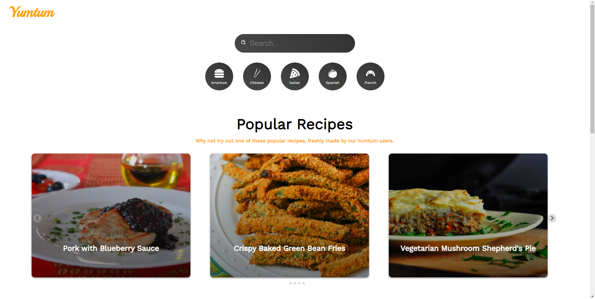
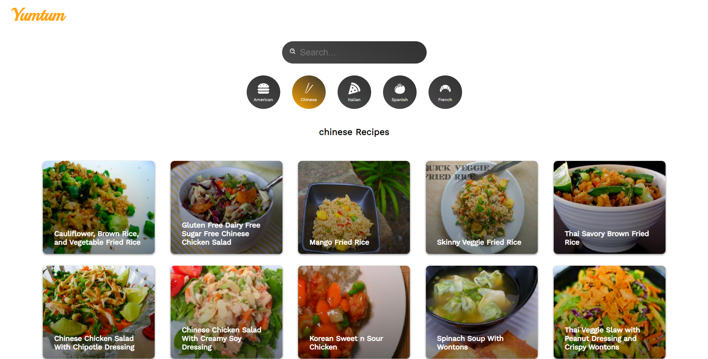
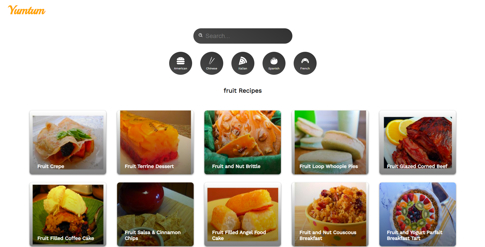
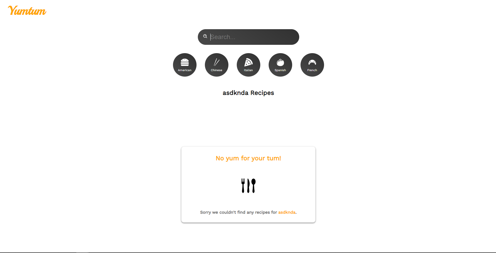
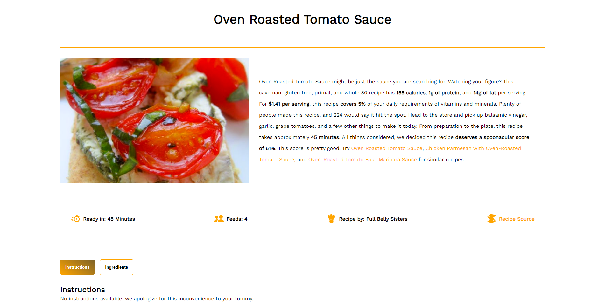

# Yumtum

## Table Of Contents

- [Description](#description)
- [Deployed Application](###deployed-Application)
- [User Story](#user-Story)
- [Installation](#installation)
- [Technology Used](#technology-used)
- [Screenshots](#screenshots)
- [Contributors](#contributors)

## Description

Yumtum, short for Yummy in my Tummy, has the tastiest of recipes users can browse through. Users are able to browse a collection of recipes including vegetarian, vegan, and multiple cuisines such as American, Chinese, French, and more! Users are also able to search for specific recipes and view detailed instructions for selected recipes.

## Deployed-Application

https://colinjhedwards.github.io/yumtum/

## User-Story

    As A food enthusiast,

    I WANT to be able to browse a collection of recipes and search for specific recipes,

    SO THAT I can either learn how to cook a dish or decide what dish to cook next.

## Installation

- Clone the repository from https://github.com/ColinJhEdwards/yumtum/.
- Cd into the correct folder and enter "npm i" to install necessary packages.
- Enter "npm start" to start the server.

## Technology Used

- TypeScript
- React
- React Router Dom
- Styled Components
- Framer Motion
- React Splide
- Html React Parser
- gh pages

## Screenshots

## Contributors

This app brought to you by:

- Colin Edwards https://github.com/ColinJhEdwards
